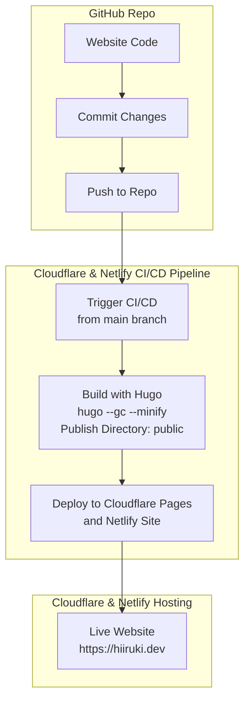

# hiiruki.dev

_yet another personal website._

 

This is my personal website. It's built with [Hugo](https://gohugo.io/) and hosted on [Cloudflare](https://cloudflare.com/) and [Netlify](https://www.netlify.com/) and using [Kamigo](https://github.com/hiiruki/hugo-Kamigo) theme. You can visit [here](https://hiiruki.dev).

> [!NOTE]
> Main hosting is on Cloudflare and Netlify is used as a backup hosting. The website is served over HTTPS and has a valid SSL certificate. I moved from Netlify to Cloudflare because of the better performance and security features and most of my domains are already on Cloudflare. Netlify is still used as a backup hosting.

## Pagespeed Insights

[Google Pagespeed Insights](https://pagespeed.web.dev/analysis/https-hiiruki-dev/rqaiq47qyp?form_factor=mobile) score for this website.

#### Mobile

#### Desktop

## Architecture

- [Hugo](https://gohugo.io/) is responsible for using templates and markdown files to create pages, as well as building other files needed for cosmetics (it's a static site generator).
- [Cloudflare Pages](https://pages.cloudflare.com/) is responsible for building the website and deploying it to the Cloudflare edge network. It's used as the [main hosting](https://hiiruki-dev.pages.dev/).
- [Netlify](https://www.netlify.com/) is responsible for building the website and deploying it to the Netlify edge network. Now it's used as a secondary or [backup hosting](https://hiiruki.netlify.app/).
- [Kamigo](https://github.com/hiiruki/hugo-Kamigo) is a Hugo theme that I created for this website. It's a fork of the [PaperMod](https://github.com/adityatelange/hugo-PaperMod) theme. It's focused on customization, improving code quality, UI/UX improvement, and security improvement or hardening to the original/previous mod theme.
- [GitHub](https://github.com) is used for version control and hosting the source code of the website.

## Flow

## License

### Content

 

The content of this website is licensed under [CC BY-NC-SA 4.0](https://creativecommons.org/licenses/by-nc-sa/4.0/)

### Source Code

The source code of this website is licensed under [MIT](/LICENSE)
