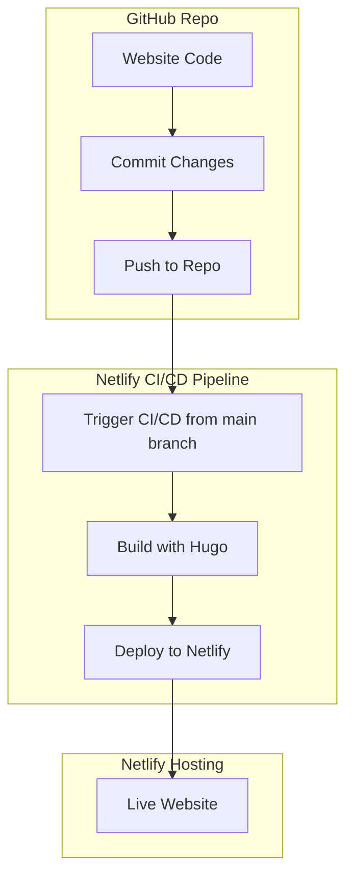

# hiiruki.dev

_yet another personal website._

This is my personal website. It's built with [Hugo](https://gohugo.io/) and hosted on [Netlify](https://www.netlify.com/) and using [Kamigo](https://github.com/hiiruki/hugo-Kamigo) theme. You can visit [here](https://hiiruki.dev).

## Pagespeed Insights

[Google Pagespeed Insights](https://pagespeed.web.dev/analysis/https-hiiruki-dev/rqaiq47qyp?form_factor=mobile) score for this website.

#### Mobile

#### Desktop

## Flow

## License

The content of this website is licensed under [CC BY-NC-SA 4.0](https://creativecommons.org/licenses/by-nc-sa/4.0/).

The source code of this website is licensed under [MIT](/LICENSE).
