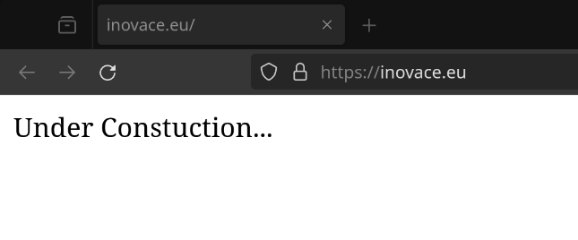
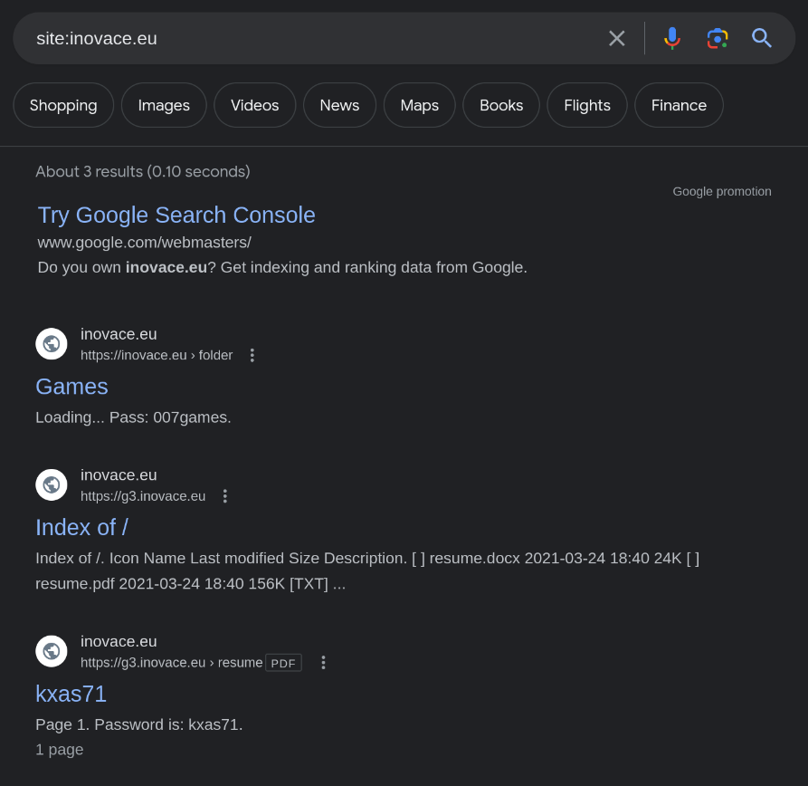
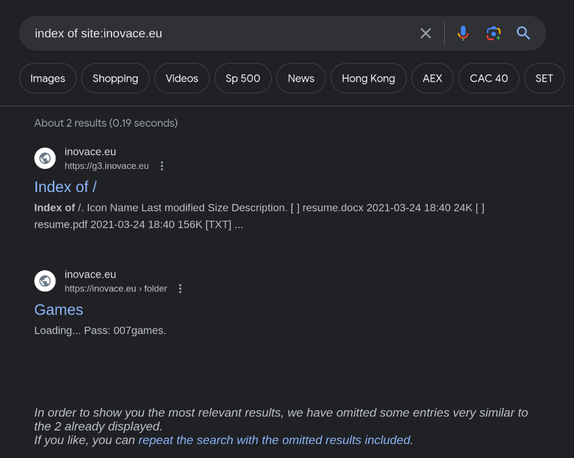
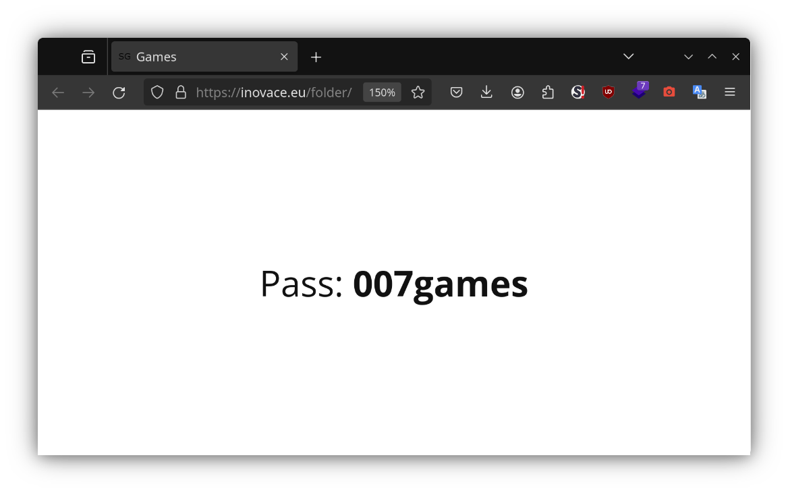
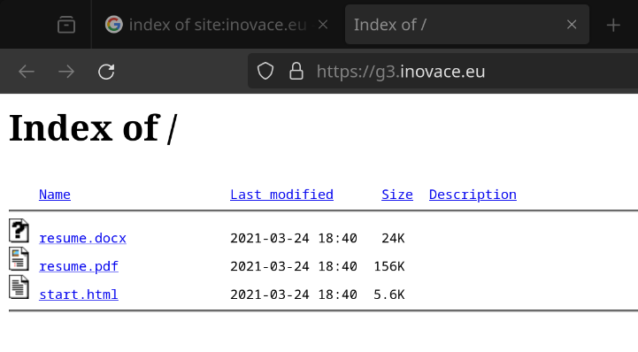
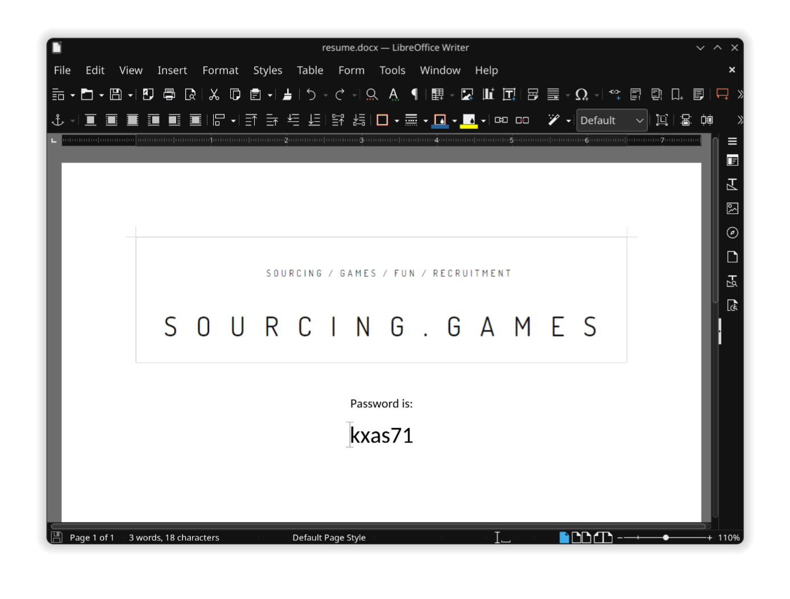
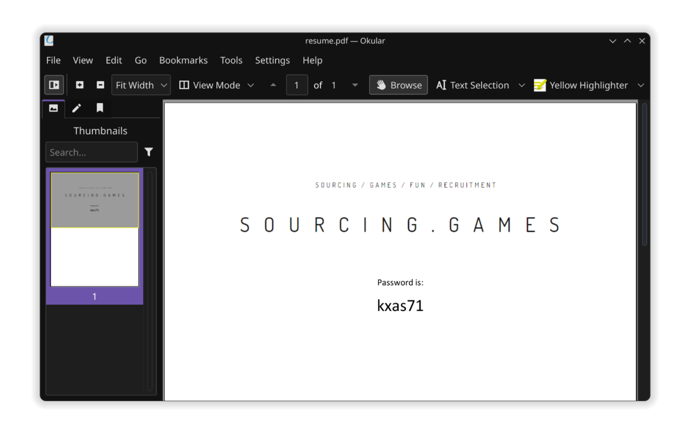
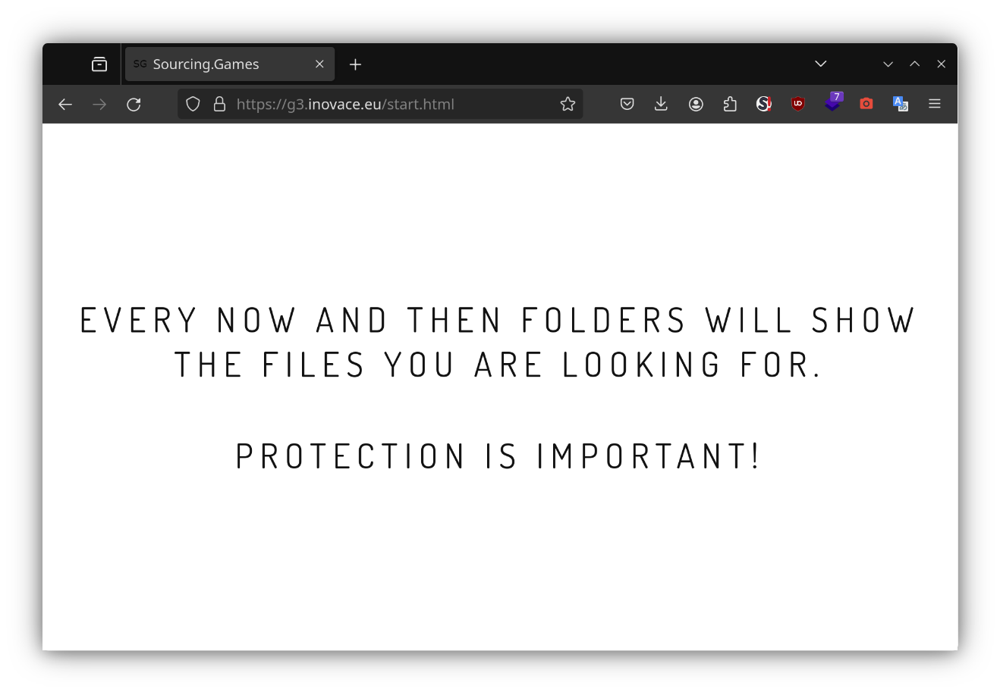
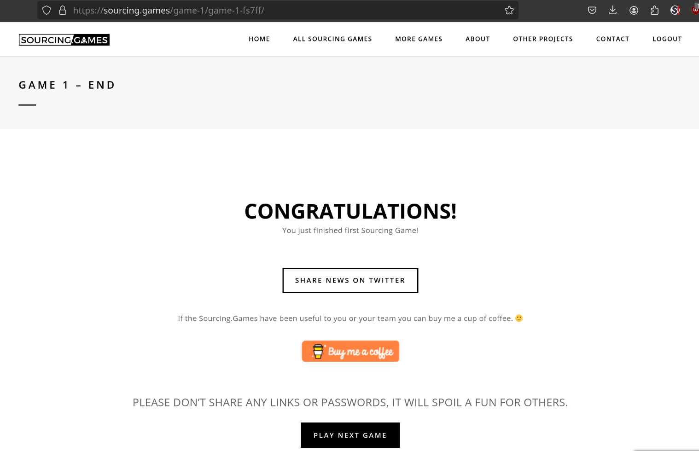

## Description

One folder of this website “[inovace.eu](https://inovace.eu/)” was indexed by Google.

You can find there the password for the next level.

## Instructions

Use the password from the site

## Solution

Based on the description, some folder of the website `inovace.eu` was indexed by Google and maybe has [directory listing](https://probely.com/vulnerabilities/directory-listing) enabled.

But I'm curious about the website, so I'll visit it first.



Turns out, the website is under construction. So, let's find the directory.

To find the directory, we can use the following Google dork:

```plaintext
site:inovace.eu
```



or

```plaintext
index of site:inovace.eu
```



Well that was easy. The result shows the password in google search result. The password is `007games` which in the `/folder` directory (https://inovace.eu/folder/).



Well the website also has directory listing enabled. So, let's visit the directory.



in the directory, there are 3 files which are:

- [`resume.docx`](files/resume.docx)



- [`resume.pdf`](files/resume.pdf)



- [`start.html`](files/start.html)



The file `resume.docx` and `resume.pdf` both contain password `kxas71`. But, when I tried to use the password, it didn't work. So, I tried the password from `/folder` directory, and it worked. So, the password is `007games`.

The `kxas71` password either is a _red herring_ or for another level.

And we finished the first Sourcing Game! 🎉



## Flag/Password

<details>
<summary> Show </summary>

`007games`

</details>
